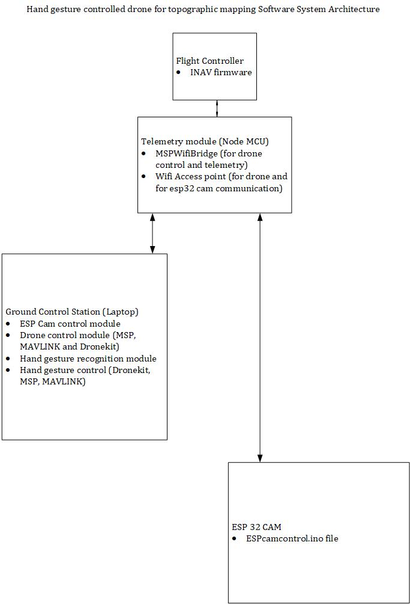

# ✋🛸 Hand Gesture-Controlled Drone for Topographic Mapping

This project implements a gesture-controlled drone system capable of performing automated topographic mapping. Using hand landmarks detected via computer vision, the drone is guided through commands like takeoff, land, direction control, yaw, and a custom **RTH-triggered photogrammetry mode**.

It supports both **MSP** (MultiWii Serial Protocol) and **MAVLink** implementations. It also has a module for dronekit implementation, but it doesnt have an app for it, that would come later

---

## 🧠 System Architecture



---

## 📁 Project Structure

```
gesture-drone-mapper/
├── esp32cam/                  # Firmware (.ino) + control module for ESP32-CAM
├── drone_control/            # Drone control modules (MSP & MAVLink)
├── hand_gesture/             # Gesture detection & GUI apps
├── gesture_commands/         # gesture definitions
├── gifs/                     # Demo GIFs for simulation & real flight
├── docs/                     # Architecture images, docs, future assets
```

---

## 🚀 Features

- 🔍 Real-time hand gesture recognition using MediaPipe
- 🧭 Full drone control: pitch, roll, yaw, thrust
- 📷 ESP32-CAM image capture module
- 📡 Supports both MSP (via serial or WebSocket) and MAVLink (via UDP)
- 🗺️ Triggered topographic mapping using RTH and `START`/`STOP` image capture
- 🎮 Tkinter-based GUI for control & visualization

---

## 🕹️ Apps

### 1. DroneAppMSP
```bash
python hand_gesture/DroneAppMSP_Final.py
```

### 2. DroneAppMAVLINK
```bash
python hand_gesture/DroneAppMAVLINK_Final.py
```

---

## 🧰 Requirements

- Python 3.8+
- OpenCV
- MediaPipe
- tkinter
- pyserial (for MSP)
- pymavlink / dronekit (for MAVLink)
- WebSocket-client
- Your ESP32-CAM must be flashed and networked

---

## 🛠️ How to Package as `.exe`

### 🔹 Using PyInstaller (terminal method)

```bash
pip install pyinstaller
pyinstaller --onefile hand_gesture/DroneAppMAVLINK_Final.py
```

For GUI mode (no terminal):

```bash
pyinstaller --onefile --noconsole hand_gesture/DroneAppMAVLINK_Final.py
```

### 🔹 Using auto-py-to-exe (GUI)

```bash
pip install auto-py-to-exe
auto-py-to-exe
```

Select:
- Script: `hand_gesture/DroneAppMAVLINK_Final.py`
- Onefile + Window Based
- Add any icons or resources as needed


---

## 📜 Acknowledgements

- MSP-over-WiFi bridge adapted from:  
  🔗 [fpv-wtf/MSPWiFiBridge](https://github.com/fpv-wtf/MSPWiFiBridge)

- ESP32-CAM firmware inspired by open WebSocket camera modules

- Gesture detection powered by [MediaPipe Hands](https://google.github.io/mediapipe/solutions/hands)

---

## 🧑‍💻 Maintainer

**Yusuf Solomon**  
🧠 Mechatronics | 🤖 Robotics | 📡 IoT | 🛠️ Embedded Systems  
🔗 [LinkedIn](https://www.linkedin.com/in/yusuf-solomon/)

---

## 📌 Future Plans

- Add voice control alongside gesture interface  
- Port to Android   
- Live video streaming from ESP32-CAM into the app  


---

## ⭐️ If you found this useful, please star the repo!
